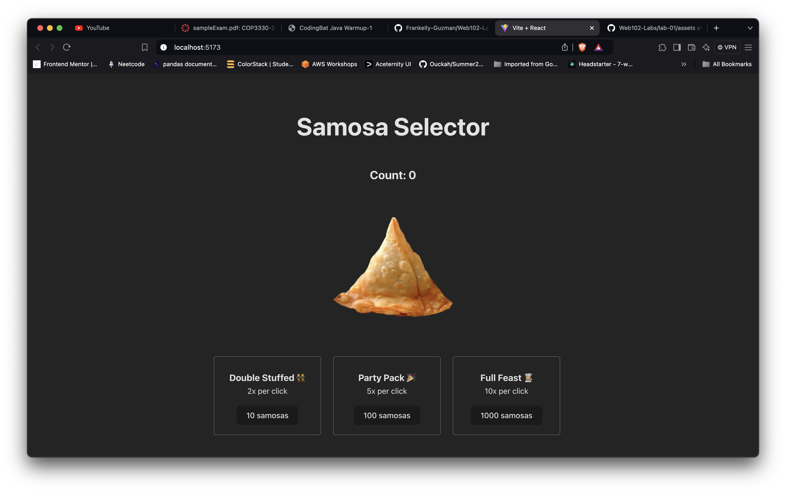

# Lab 02: Samosa Selector

## Overview

In this lab, we built an incremental game called **Samosa Selector**, inspired by the game **Cookie Clicker**. Instead of clicking a cookie, the player clicks a samosa to collect as many as possible. As the player accumulates samosas, they can purchase upgrades that increase their samosa production rate.

## Gameplay

- The user starts with zero samosas.
- Clicking the **Big Samosa** generates one samosa per click.
- As the user collects samosas, they can purchase upgrades:
  - **Double Stuffed**: Produces 2x samosas per click (available at 10 samosas).
  - **Party Pack**: Produces 5x samosas per click (available at 100 samosas).
  - **Full Feast**: Produces 10x samosas per click (available at 1000 samosas).

The game continues indefinitely, and the user can accumulate massive amounts of samosas.

## Required Features

1. **Clickable Samosa**: A large samosa image that the user can click to increase their samosa count by one.
2. **Samosa Counter**: A display showing the number of samosas the user has collected.
3. **Upgrades**: Three upgrades that increase samosa production when purchased:
   - **Double Stuffed** (2x per click)
   - **Party Pack** (5x per click)
   - **Full Feast** (10x per click)

## Stretch Features

- **Deduct Samosas for Upgrades**: When an upgrade is purchased, the required number of samosas is deducted from the total.
- **Pulse Effect**: The samosa image shrinks when clicked and grows slightly when hovered over to create a "pulse" effect.

### Screenshot of App

## Technologies Used

- **React**: Implemented with React's `useState` hook to manage state for samosa count and upgrades.
- **CSS**: Used for styling the UI and adding effects like scaling the samosa image on hover and click.

## Key Concepts

- **State Management**: Using the `useState` hook to track samosas and upgrade purchases.
- **Event Handling**: Handling user interactions, like clicks on the samosa and buttons for upgrades.
- **Conditional Logic**: Checking if the user has enough samosas to purchase upgrades and applying multipliers accordingly.

## Resources

- [Vite: Getting Started](https://vitejs.dev/guide/)
- [ReactJS: Using the State Hook](https://reactjs.org/docs/hooks-state.html)
- [W3 Schools: React Events](https://www.w3schools.com/react/react_events.asp)

## Conclusion

Through this lab, we learned how to manage state and handle user events in React, creating a fun and interactive game. The project provided an excellent opportunity to practice React fundamentals like state and event handling while also exploring basic game mechanics.

Feel free to revisit the lab code and add more stretch features as you improve your skills!
